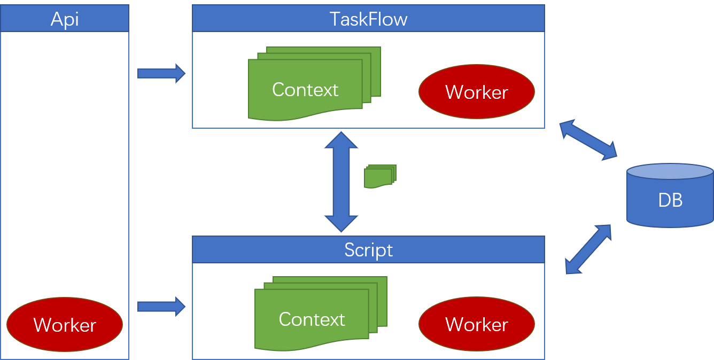
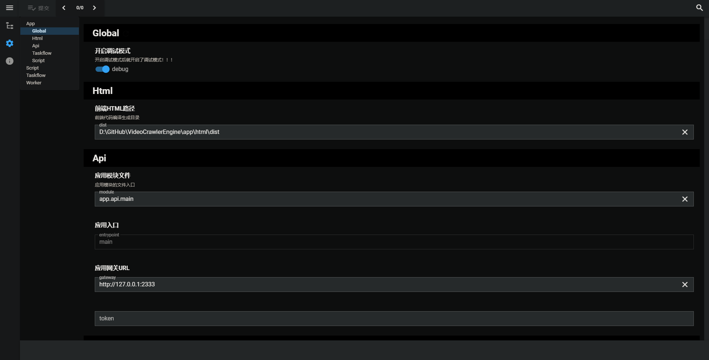
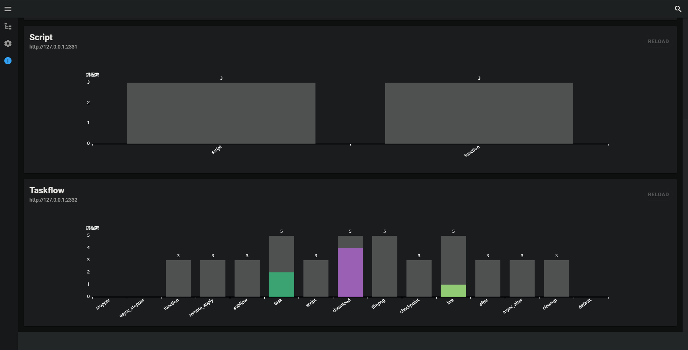

VideoCrawlerEngine
===============

# 视频爬取引擎

视频爬虫引擎是以自定义脚本为草图，生成请求器工作流，实现可控可视的流水线执行。
意在提高脚本的开发效率，让开发者专注于解决反爬。

# 项目架构

## 后端

``Python`` + ``Fastapi``

### 架构图

应用架构

### 应用路径
> 
> __中间件__: ``./app/api/``
>
> __任务流__: ``./app/taskflow/``
>   
> __脚本引擎__: ``./app/script/``
>   

## 前端

``Vue`` + ``Vuetify``

### 应用路径
> __开发路径__： ``./app/html/``

### 前端UI

#### 任务列表 
显示所有被创建的任务。

#### 任务详情
显示任务的具体运行情况，包括执行流程、进度、日志等情况。

#### 配置选项
应用的所有可配置信息（配置文件处于``./conf/``目录下）

#### 应用状态
查看应用的运行状态，其中包括工作线程池运行情况。

## 安装

### 依赖

- __Python__ >= 3.7

- __安装Python库依赖__(建议使用虚拟环境)

    pip install -r requirements.txt

#### __使用虚拟环境安装依赖库__

- 新建venv目录

    mkdir venv venv

- 创建虚拟环境

    
    python venv venv

- 进入虚拟环境
    
    
    ./venv/Scripts/activate
    

- 按照上面``依赖``中的依赖库安装方式进行安装依赖

    
### 使用

- 进入项目目录，运行如下启动后台服务器

    python main.py

注意：上述命令会启动三个后台服务器，
分别是（Api, Script, TaskFlow）

在默认配置文件下：

- Api应用: http://127.0.0.1:2333

- TaskFlow应用: http://127.0.0.1:2332

- Script应用: http://127.0.0.1:2331

## 开发

### 后端

依赖安装方式参考上面的``安装``

### 前端

#### 依赖
- 安装``Nodejs``

- 安装``yarn``

    
    npm install yarn -g
    
- 进入``./app/html``

    cd ./app/html
    
- 安装依赖库

    yarn install

- 运行调试器

    yarn dev

- 编译项目

    yarn build

## 许可证

Apache-2.0
