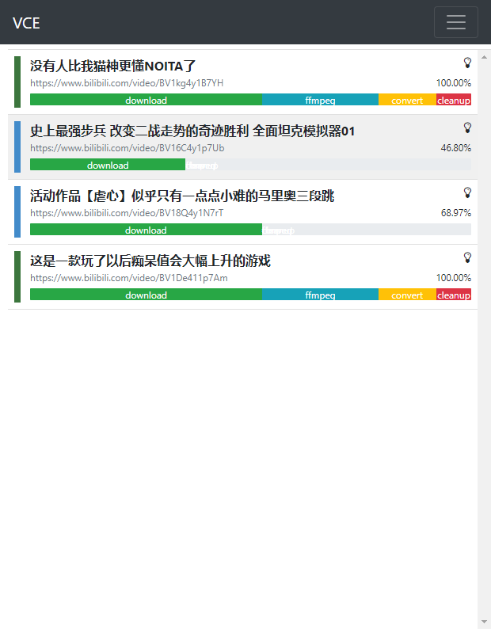

VideoCrawlerEngine
===============

# 视频爬取引擎

视频爬虫引擎是以自定义脚本为草图，生成请求器工作流，实现可控可视的流水线执行。
意在提高脚本的开发效率，让开发者专注于解决反爬。

## WEB UI

## 环境搭建
> pip install -r requirements.txt

## 使用方法
> python main.py

- 开启本地服务器(默认端口2333)

- 浏览器打开 http://localhost:2333

## 架构草图

## Requirements

- Python >= 3.6
- Nbdler >= 3.0.3
- PyJSCaller >= 0.2.0
- Flask

## 许可证

Apache-2.0

## TODO
- [ ] 脚本开发文档
- [ ] 请求器开发文档
- [ ] 脚本执行和web server实现进程隔离

## 关于

项目已完成初步开发，后续的开发主要倾向于功能的完善和修复漏洞。